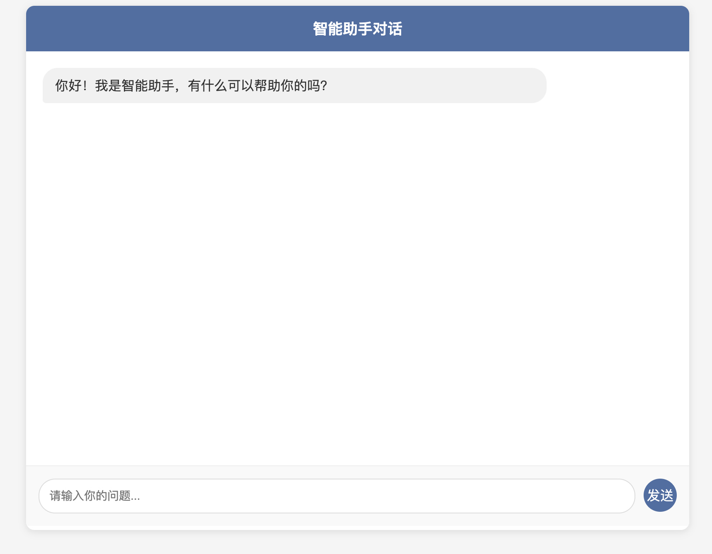

这是一个LangChain demo项目

启动步骤
# 1. 创建虚拟环境
python3 -m venv venv

# 2. 激活虚拟环境 (Mac/Linux)
source venv/bin/activate
或 (Windows)
venv\Scripts\activate

# 3. 安装依赖
pip install -r requirements.txt

# 4. 配置环境变量
需要创建一个.env文件，用于存储环境变量，然后添加
DEEPSEEK_API_KEY
OPENWEATHER_API_KEY
两个配置

# 5. 启动服务
python main.py
启动服务后访问 http://localhost:8000 可直接使用对话功能   

